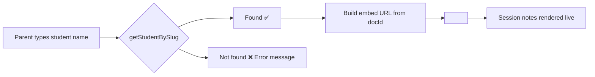

<div align="center">

# 🧮 NXT STEP TUTORING — Math Tutor Portfolio

**A beautiful, animated, single-page portfolio for an online math tutor — with a fully working student‑notes system that runs on **zero backend**.**

[](https://react.dev)
[](https://vite.dev)
[](https://reactrouter.com)
[](https://pages.github.com)
[](#)
[](#license)

> ⚡ **No server. No database. No API. No login. Just a static site that does full CRUD.**
> The whole thing is a single React app that you can host **for free** on GitHub Pages.

### 🔗 Live Demo

**[👉 Visit nxtsteptutoring.com](https://www.nxtsteptutoring.com/)** — see it live in production right now.

</div>

---

## 📖 Table of Contents

- [🚀 Project Idea](#-project-idea)
- [⭐ The Star Feature — CRUD With No Backend](#-the-star-feature--crud-with-no-backend)
- [🧠 How It Actually Works](#-how-it-actually-works)
- [✨ Features](#-features)
- [🛠️ Tech Stack](#️-tech-stack)
- [📁 Project Structure](#-project-structure)
- [▶️ Getting Started](#️-getting-started)
- [📚 Step‑by‑Step Tutorial](#-stepby-step-tutorial)
- [🗂️ CRUD Tutorial — Manage Students Like a Pro](#️-crud-tutorial--manage-students-like-a-pro)
- [🎨 Design System — Colours That Feel Like Math Done Right](#-design-system--colours-that-feel-like-math-done-right)
- [🪄 Animations Everywhere](#-animations-everywhere)
- [🚢 Deploying to GitHub Pages](#-deploying-to-github-pages)
- [💡 Ideas to Take It Further](#-ideas-to-take-it-further)
- [❓ FAQ](#-faq)
- [📄 License](#-license)

---

## 🚀 Project Idea

Every online tutor needs two things: a **portfolio that builds trust**, and a **private way to share each student's session notes**. Usually that means a full‑stack app with a database, auth, and a server — expensive to build and annoying to maintain.

**This project flips that on its head.**

It's a stunning, single‑page React portfolio (Home · About · Services · Contact) that doubles as a **Student Notes Portal**. Parents enter their child's name, and the app instantly loads that student's live session notes — powered by **Google Docs embeds** and a **tiny in‑code "database"**, with **no backend anywhere in sight**.

### Why build this?

| | 💾 Traditional approach | ⚡ This approach |
|---|---|---|
| **Server** | Express / Node server | ❌ None |
| **Database** | MongoDB / Postgres | ❌ None |
| **Auth** | JWT + cookies | ❌ None |
| **Hosting cost** | Paid Dyno / VM | 🆓 Free (GitHub Pages) |
| **Notes storage** | Your own DB | 🆓 Free (Google Docs) |
| **Time to ship** | Days | ⏱️ Minutes |
| **Maintenance** | Updates, backups, scaling | Just edit one file |

> 💡 **The punchline:** this project proves you can deliver a professional, interactive, data‑driven web app **without writing a single line of server code**.

---

## ⭐ The Star Feature — CRUD With No Backend

Here's the big one. Everyone assumes CRUD (Create, Read, Update, Delete) requires a database. **This app does all four using a plain JavaScript file and the browser.**

Our "database" is `portfolio-react/src/data/students.js` — a simple array of objects. And our "file storage" for notes is **Google Docs**, published to the web and embedded with an `<iframe>`.

### The CRUD cheat‑sheet

| Operation | Where it happens | How it's done |
|---|---|---|
| ➕ **C**reate | `src/data/students.js` | Add a new `{ name, slug, docId }` object |
| 📖 **R**ead | `NotesPage.jsx` | `getStudentBySlug(slug)` filters the array → renders the embed |
| ✏️ **U**pdate | `src/data/students.js` | Change the `name` or `docId`, rebuild, redeploy |
| 🗑️ **D**elete | `src/data/students.js` | Remove (or comment out) the object |

**Bonus CRUD:** the dark/light theme is also persisted without a backend — via `localStorage` in `App.jsx`!

```js
// 🗄️ "The database" — src/data/students.js
export const students = [
  {
    name: 'Pavithramenon',
    slug: 'pavithramenon-780',                 // appears in the URL: /notes/pavithramenon-780
    docId: '2PACX-1vSWMows4JOiRjuwHcjT...',    // the Google Doc embed ID (the "file")
  },
  // ... add as many students as you like
]

// 🔎 "The query" — just an array lookup, no database engine needed
export const getStudentBySlug = (slug) => {
  return students.find(student => student.slug === slug)
}
```

### Why does this even work? 🤔

1. **A JavaScript module is data.** `students.js` gets bundled into the static site, so the data travels with the app — no fetch, no network round‑trip.
2. **Google Docs is the file server.** When you *Publish → Embed* a Google Doc, Google gives you a public embed ID (`docId`). The app builds this URL on the fly:
   ```
   https://docs.google.com/document/d/e/{docId}/pub?embedded=true
   ```
3. **The browser is the runtime.** `NotesPage.jsx` looks up the slug with `.find()`, then drops the URL into an `<iframe>`. Google does all the heavy lifting — the app just points to it.
4. **Static hosting is the deploy.** A folder of HTML/CSS/JS needs no server. GitHub Pages (or Netlify, Vercel) serves it globally for free.

> 🏆 **Result:** `CREATE` = add an object · `READ` = array lookup + iframe · `UPDATE` = edit fields · `DELETE` = remove the object. Full CRUD, zero backend, zero cost, zero maintenance.

---

## 🧠 How It Actually Works



```
┌─────────────────────────────────────────────────────────────┐
│                      STATIC REACT APP                        │
│                                                             │
│   ┌─────────────┐   ┌────────────────────────────────────┐  │
│   │ students.js │   │   NotesPage (/notes/:slug)          │  │
│   │  (array =   │──▶│   .find(slug) → build URL → iframe  │  │
│   │  "database")│   └──────────────┬─────────────────────┘  │
│   └─────────────┘                  │                       │
│                                    ▼                       │
│                         Google Docs (published)             │
│                         "the file storage, run by Google"   │
└─────────────────────────────────────────────────────────────┘
                     Hosted on GitHub Pages
```

**Routing in a nutshell:**

- `/` → the portfolio (Home · About · Services · Contact) rendered by `App.jsx`
- `/notes` → a form where parents type a student name (`NotesPage.jsx`)
- `/notes/:slug` → that student's embedded session notes, e.g. `/notes/pavithramenon-780`

The router also handles the **GitHub Pages SPA redirect** (see `index.html`) so deep links like `/notes/noah-782` work even on refresh. 🎉

---

## ✨ Features

- 🏠 **Animated hero** — typewriter brand title with a blinking gold cursor
- 🌐 **Curriculum flags** — US 🇺🇸 UK 🇬🇧 Canada 🇨🇦 IB 🌐
- 📈 **Live stats** — 11+ years, 1:1 sessions, EST/CST/PST support
- 💬 **Auto‑scrolling feedback marquee** — real parent testimonials, pause + expand on click
- 📝 **Session Notes portal** — enter a name, get the live Google Doc
- 🎭 **Dark / Light themes** — persisted in `localStorage`, one‑click toggle with pop animation
- 📱 **Fully responsive** — desktop sidebar layout collapses into a mobile hamburger menu
- 🗺️ **SEO‑friendly titles** — document title updates per page & per student
- 🛣️ **SPA routing** — React Router 7 with GitHub Pages redirect support
- 🚀 **Blazing fast build** — Vite 8 + React 19

---

## 🛠️ Tech Stack

| Layer | Choice | Why |
|---|---|---|
| Framework | **React 19** | Component‑based, hooks, huge ecosystem |
| Build tool | **Vite 8** | Instant HMR, tiny bundles |
| Routing | **React Router 7** | Clean client‑side routes `/notes/:slug` |
| Icons | **Ionicons 5** | Crisp, consistent outline icons |
| Fonts | **Poppins** | Friendly geometric sans‑serif |
| Data store | **A JS module** 🗄️ | No database needed! |
| Content storage | **Google Docs** 📄 | Free, familiar, live‑editable |
| Hosting | **GitHub Pages** | Free static hosting + `gh-pages` script |
| Linting | **Oxlint** | Fast, zero‑config safety net |

---

## 📁 Project Structure

```
portfolio-react/
├── index.html                 # Entry HTML + SPA redirect + Ionicons
├── vite.config.js             # Vite config (base '/')
├── package.json               # Scripts: dev / build / preview / deploy
├── public/assets/images/      # Avatar, favicon, etc.
└── src/
    ├── main.jsx               # React root
    ├── App.jsx                # Router + Layout + theme logic
    ├── style.css              # Full design system + animations (3,700 lines)
    ├── data/
    │   └── students.js        # 🗄️ THE "database" — the CRUD heart
    └── components/
        ├── Sidebar.jsx        # Profile card + contacts (desktop)
        ├── Navbar.jsx         # Desktop nav + mobile hamburger
        ├── Home.jsx           # Hero, stats, services, marquee
        ├── About.jsx          # Bio + experience
        ├── Services.jsx       # Services detail page
        ├── Contact.jsx        # Contact form + links
        ├── NotesPage.jsx      # 📖 READ: student lookup + embed
        ├── NotFound.jsx       # 404 fallback
        ├── ThemeToggle.jsx    # Dark/light switcher
        └── ThemeToggle.css
```

---

## ▶️ Getting Started

**Prerequisites:** [Node.js](https://nodejs.org) 18+ and npm.

```bash
# 1. Go into the frontend folder
cd portfolio-react

# 2. Install dependencies
npm install

# 3. Start the dev server (hot reload)
npm run dev
```

Open the URL printed in the terminal (usually `http://localhost:5173`) — and that's it. You're running a full CRUD app with no backend. 😄

**Useful commands:**

| Command | What it does |
|---|---|
| `npm run dev` | Start dev server with hot reload |
| `npm run build` | Create production build in `dist/` |
| `npm run preview` | Preview the production build locally |
| `npm run lint` | Run Oxlint |
| `npm run deploy` | Build + push to GitHub Pages |

---

## 📚 Step‑by‑Step Tutorial

### 1️⃣ Explore the portfolio
Run `npm run dev`, then click through **Home → About → Services → Contact**. Watch the hero typewriter effect and the scrolling testimonials. Click the theme toggle in the corner to switch between the dark and light skins.

### 2️⃣ Try the Notes portal
In the navbar, click **Notes**. Type a student name — try `pavithramenon-780` — and press *View Notes*. The app finds the student and loads their live Google Doc.

**Try a wrong name** (e.g. `sarah-999`) — you'll get a friendly *"Student not found"* page with a *Try Again* button. That's error handling, all client‑side.

### 3️⃣ Peek at the "database"
Open `src/data/students.js`. Each entry is a student record:
- `name` → the label shown in the header
- `slug` → the URL identifier (this is what parents type in)
- `docId` → the Google Doc embed ID (the actual content)

### 4️⃣ Make it yours
- **Change the tutor name** → edit `Sidebar.jsx` (the `<h1 className="name">`) and the `index.html` title.
- **Edit testimonials** → they're a plain array at the top of `Home.jsx`.
- **Change colors** → the entire design is driven by CSS variables in `:root` of `style.css`.
- **Swap avatar** → replace `public/assets/images/avatar-3.png`.

---

## 🗂️ CRUD Tutorial — Manage Students Like a Pro

This is the heart of the app. Let's walk through every CRUD operation with **no backend**.

### ➕ CREATE — add a new student

1. Publish the student's Google Doc: open the doc → **File → Share → Publish to web → Embed**. Copy the long ID from the embed URL (the part after `e/` and before `/pub`).
2. Open `src/data/students.js` and append a new object:

```js
export const students = [
  // ...existing students...
  {
    name: 'Jane Smith',
    slug: 'jane-smith-800',
    docId: '2PACX-1vRqS3q4grMlKN3RO1gyG6SUdH8EQhJDYNrCZPZqukxRTKoHy3Sod17kEpov836JFlUCqZ5Tmw3F99Sc',
  },
]
```

3. That's it. Save, and the app hot‑reloads. Now `/notes/jane-smith-800` exists.

### 📖 READ — view notes

Two paths, both client‑side:

- **By form:** `/notes` → type `jane-smith-800` → `NotesPage` calls `getStudentBySlug` → renders the `<iframe>`.
- **By URL:** go straight to `/notes/jane-smith-800`.

### ✏️ UPDATE — edit a student

- **Edit the name/slug** → change the fields in `students.js`.
- **Edit the actual notes** → just edit the Google Doc itself. The iframe picks up the changes instantly — **no redeploy needed for content updates**. 💛

### 🗑️ DELETE — remove a student

```js
export const students = [
  // { name: 'Jane Smith', slug: 'jane-smith-800', docId: '...' },  // 🙈 comment it out…
  { name: 'Noah', slug: 'noah-782', docId: '...' },                  // …or just delete the line
]
```

Save → the route is gone. Parents who try that slug get the *Student Not Found* screen.

> ⚡ **The 30‑second mental model:** editing `students.js` is like running an `INSERT`, `UPDATE`, or `DELETE` query. Publishing the doc is the `INSERT` into your "files table". The browser is the SQL engine.

---

## 🎨 Design System — Colours That Feel Like Math Done Right

The whole look lives in CSS variables (`style.css`), so the palette is a **one‑line change** away. Two themes ship out of the box: a warm **dark mode** and a clean **light mode**.

### Dark theme (default) 🌑

| Token | Colour | Hex |
|---|---|---|
| `--eerie-black-1` | Deep background | `hsl(240, 2%, 13%)` |
| `--onyx` | Card surface | `hsl(240, 1%, 17%)` |
| `--orange-yellow-crayola` | ✨ Signature gold | `hsl(45, 100%, 72%)` |
| `--vegas-gold` | Gold accents | `hsl(45, 54%, 58%)` |
| `--light-gray` | Text | `hsl(0, 0%, 84%)` |
| `--text-gradient-yellow` | Headline gradient | gold → amber |

### Light theme 🌤️
Toggled with `[data-theme='light']` — same tokens, remapped to soft grays, cream surfaces, and a slightly deeper gold (`hsl(38, 90%, 42%)`) for contrast on light backgrounds.

**Why gold?** Gold reads as *achievement, excellence, and value* — exactly the message a math tutor wants to send. The near‑black background gives the gold a chance to glow, and the letter‑by‑letter gold shine animation on the hero title ties it all together.

---

## 🪄 Animations Everywhere

| Animation | Where | Defined in |
|---|---|---|
| ⌨️ Typewriter brand title | Hero header | `Home.jsx` `useEffect` |
| ➖ Blinking gold cursor | Hero title | `@keyframes blink-cursor` |
| ✨ Letter‑by‑letter gold shine | Hero title | `@keyframes letterGoldenShine` |
| 🎞️ Auto‑scrolling testimonials | Home | `@keyframes marquee` (40s loop) |
| 💡 Pulse status dot | Sidebar | `@keyframes pulse-green` |
| 🖼️ Card hover glow | Sidebar avatar | `@keyframes beat` |
| 🔄 Spinning gradient border | Ad cards | `@keyframes ad-border-spin` |
| 🎛️ Theme icon pop | Toggle | `@keyframes icon-pop` |
| 🌊 Page fade + scale | Route/content | `@keyframes fade`, `scaleUp` |

To tone things down for motion‑sensitive visitors, wrap the heavy ones in a `@media (prefers-reduced-motion: reduce)` query — an easy accessibility win.

---

## 🚢 Deploying to GitHub Pages

```bash
cd portfolio-react
npm run deploy
```

That runs `npm run build` (creating `dist/`) and pushes it with `gh-pages`. In your GitHub repo settings set the Pages source to **GitHub Pages branch** (or `gh-pages`).

**Because there's no backend, this site is effectively free to host forever** — no Dynos, no MongoDB Atlas, no payment forms. 💸

---

## 💡 Ideas to Take It Further

- 🌓 Add an **auto theme** that follows the system setting (`matchMedia('(prefers-color-scheme: dark)')`).
- 📅 Plug a **Google Calendar embed** into the Contact page for live availability.
- 🧮 Build a small **built‑in calculator / quiz** section to show off math interactivity.
- 📝 Add a **resources page** that embeds public worksheets from Google Docs or Slides.
- 📊 Track visits with a tiny **static‑friendly analytics** (e.g. a lightweight pixel/plausible).
- 🔒 For true write‑from‑browser flows, keep the no‑server idea and use **localStorage + download/export** instead of a backend.
- 🎨 If you outgrow one file, split `students.js` into `data/students/*.js` and re‑export.

---

## ❓ FAQ

**Q: Is this really "no backend"?**
A: 100%. No server process, no API, no database, no auth. The data is a JavaScript module; the content is Google Docs; the runtime is the browser; the host is static files.

**Q: Can parents see other students' notes?**
A: Only if they guess the slug. Slugs look like `pavithramenon-780` (not predictable). For stricter privacy, switch docIds to unlisted docs or publish only after each session.

**Q: What if I want real user sign‑up and live adds?**
A: Then you'd genuinely need a backend — that's what the `portfolio-backend` folder in this repo explores. But for a tutor managing a small roster, the no‑backend approach is simpler, faster, and free.

**Q: Why does the embed look different from my Doc?**
A: The *Publish to web → Embed* view is simplified by design (no sidebar). Use *File → Page setup* to make the doc mobile‑friendly.

**Q: How do I get a `docId`?**
A: Google Doc → **File → Share → Publish to web → Embed** → copy the ID in the URL between `/d/e/` and `/pub`.

---

## 📄 License

This project is open source under the **MIT License**. Share it, remix it, teach with it — and remember: **you don't need a server to ship something people love.** ❤️

---

<div align="center">

**Made with ⚛️ React, ⚡ Vite, and a zero‑backend philosophy.**

Built for *NXT STEP TUTORING* — helping students take the next step in math, one concept at a time.

</div>
